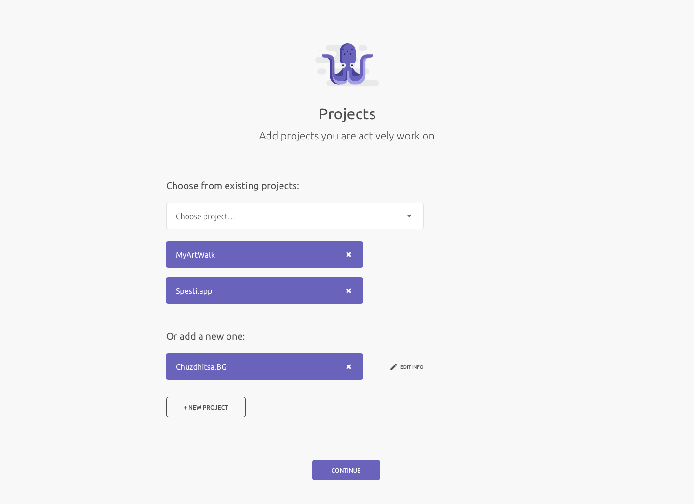
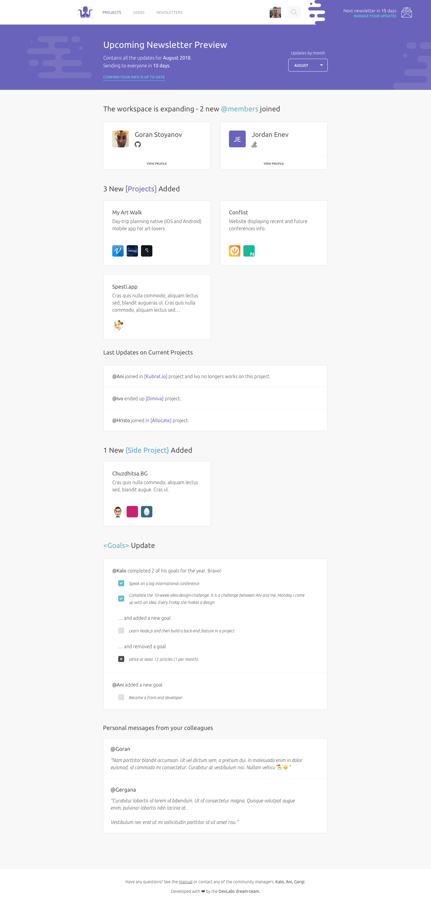
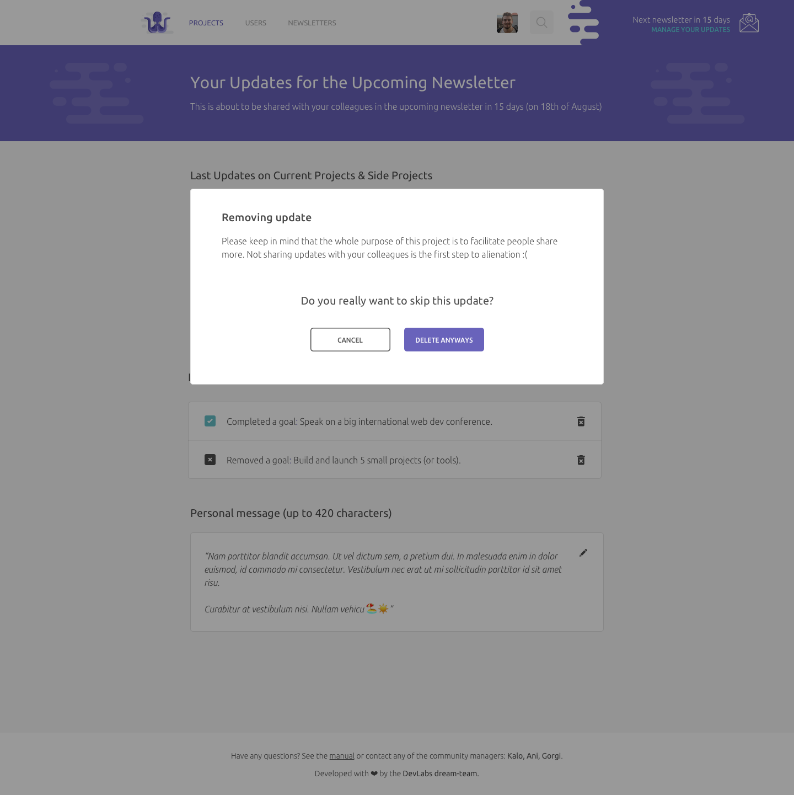

# Artboards

This is an autogenerated file showing all the artboards. Do not edit it directly.

## Artboard

## confirm-current-projects-confirmation

## confirm-current-projects-inactive

## confirm-current-projects-up-to-date

## dora-account-completion

## dora-archived-project-detailed-page

## dora-gallery-view

## dora-home-no-updates

## dora-home-no-updates2

## dora-home-not-enough-updates

## dora-landing-page

## dora-login

## dora-mobile

## dora-newsletters-archive

## dora-no-updates-available

## dora-onbording

## dora-profile-set-up-add-goals

## dora-profile-set-up-add-projects-add-new

## dora-profile-set-up-add-projects-completed

## dora-profile-set-up-add-projects-from-existing

## dora-profile-set-up-add-projects

## dora-profile-set-up-add-side-projects-add-new

## dora-profile-set-up-add-side-projects-comleted

## dora-profile-set-up-add-side-projects-from-existing

## dora-profile-set-up-add-side-projects

## dora-project-detailed-page

## dora-search-bar

## dora-updates-confirm-your-info

## dora-updates-wont-be-included

## dora-updates-youre-in

## dora-user-profile-edit-goals

## dora-user-profile

## dora-users

## edit-project-status

## footer

## header-2

## header-3

## header

## manage-your-updates

## manage-your-updates2

## newsletter v1

## newsletter v2

## newsletter v3

## removing-update-pop-up

## t-shirt1

## t-shirt2

## thanks-for-update-tooltip

